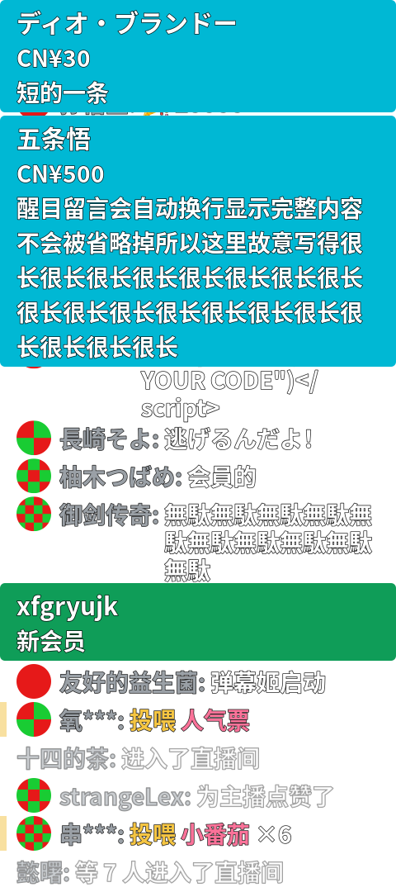

<div align="center">

# pw-live-danmaku

**把 B 站直播间的弹幕渲染成一块透明聊天面板，以 PipeWire 视频节点输出给 OBS。**

[English](README.md) · [简体中文](README.zh-CN.md)

<a href="LICENSE"></a>


</div>

<br>

<div align="center">

</div>

上图是 `--demo --dump` 的输出，默认 `480x1080`，一次覆盖了面板支持的全部消息类型：置顶的醒目留言与舰长卡片、合并计数的礼物行、合并的入场通知、头像、表情、以及按字面渲染的 `<script>`。背景是**真透明**的：叠在直播画面上不会出现任何底板。

---

> 单进程 · 无浏览器 · **零子进程** · 没有消费者连接时不渲染 · 私有内存 94 MB

## 特性

替代的是「用 OBS 浏览器源 + 一大段 CSS 定制聊天 DOM」那套做法：同样的画面，单进程、零子进程、不占浏览器内存。

- **聊天面板**，不是滚动弹幕：底部对齐、角色配色、左侧色条、折行缩进
- **头像**实时下载并裁成圆形；**表情弹幕**按 B 站给的内联图片渲染
- **礼物 / 入场 / 点赞**都画进同一列：礼物动词（`投喂`）走金色，礼物图未到时回退出来的礼物名走粉色，两者都和左侧色条同属礼物；入场与点赞压暗、不抢弹幕的注意力
- **同一个人连投同一个礼物合成一行**：窗口内按「观看者 + 礼物」分组、数量累加（`×10`），不再一行一条地刷屏；入场 notice 同样合并
- **醒目留言**独立置顶：顶边对齐、自动换行不省略、按金额停留 1 分钟～2 小时后淡出，可同时挂多条
- **上舰卡片**：实心绿卡片，跟滚动列表一起走
- **入场动画**：新消息立刻占位、把旧消息顶上去，再滑入
- **跨重启的历史**：`--history N` 把最近 N 行写到磁盘，下次启动先画出来，并用一条分割线与本次的实时弹幕分开
- **完全透明**，只有文字自带描边，叠在明亮画面上也读得清
- **按字面渲染任何文本**——弹幕里出现的 `<script>` 就是字形，不做任何标记解析
- 尺寸任意（`WxH`）、帧率上限可调
- **不连网也能调版面**：`--demo` 渲染一组固定消息

依赖只有发行版自带的系统库：没有浏览器、没有 Chromium / OBS 浏览器源，也不涉及任何语言包管理器。

## 构建

### 从源码安装

```bash
# 依赖（Arch）
sudo pacman -S --needed base-devel cairo pango gdk-pixbuf2 libpipewire curl openssl \
                   brotli zlib

git submodule update --init --recursive   # 视频节点库是子模块
make                                      # → ./pw-live-danmaku
make PORTABLE=1                           # 同上，但不加 -march=native（分发或换机器时用）
```

未初始化子模块时 `make` 会带明确提示直接报错。视频节点实现来自 [`pw-video-simple-interface`](https://github.com/zlinux-live-util/pw-video-simple-interface)（git 子模块），与姊妹项目 `pw-mpris-visualcard` 共用同一个 pin。暂未打包进 AUR。

架构、构建参数、各 `make` 目标、目录结构与依赖许可见 [docs/development.md](docs/development.md)。

## 使用

### 跑起来

```bash
./pw-live-danmaku --room 545068
./pw-live-danmaku --room https://live.bilibili.com/545068    # b23.tv 短链也能解析
```

终端会打印节点名（默认 `pw-live-danmaku`）。

### 接入 OBS

OBS 自带的 `linux-pipewire` 走 xdg-desktop-portal，只能捕获屏幕与窗口，**选不到本节点**；需要配合插件 [**obs-pwvideo**](https://github.com/tasokait/obs-pwvideo) 使用。

1. 来源 **+** → **PipeWire Video**（由 `obs-pwvideo` 提供）。
2. 下拉框里选 **Live Chat**。下拉框**显示的是节点描述**（`--desc`），实际连接的是节点名（`--node`）——这是两个不同字段。插件只在**打开属性对话框那一刻**枚举一次节点，不会刷新已打开的窗口；列表里没有的话，确认进程在跑，然后关掉再打开对话框。
3. **把源的宽高设成和 `--size` 完全一致**（默认 `480x1080`）。协商尺寸比配置小的时候画面是**被裁掉**，不是等比缩小——尺寸不一致就会缺一块。
4. 叠加到场景上即可，背景本来就是透明的。

### 开机自启

仓库里的 `pw-live-danmaku.service` 是含 `@REPO@` 与 `@ARGS@` 两个占位符的模板，安装时渲染而不是复制：

```bash
make install-service                            # 渲染 unit 到 ~/.config/systemd/user/
make install-service SERVICE_ARGS="--room 545068 --size 480x1080 --fps 30 --history 60"
make uninstall-service
systemctl --user enable --now pw-live-danmaku   # enable / start 仍需自己来
systemctl --user restart pw-live-danmaku        # 改过参数后重启才生效
```

`make install-service` 只写 unit 并 `daemon-reload`，不会替你 enable 或启动。带 cookie 时路径要写 systemd 的 `%h` 而不是 `~`——**systemd 不展开 `~`**——否则服务会每 3 秒重启一次；unit 里也已用 `StateDirectory=pw-live-danmaku` 给 `--history` 留出可写目录。理由见 [docs/cookies.md](docs/cookies.md)。

### 不开 OBS 验证画面

```bash
./pw-live-danmaku --demo --dump /tmp/panel.png                       # 假数据，不连网
./pw-live-danmaku --room 545068 --dump /tmp/x.png --count 3 -v      # 真实弹幕，画够 3 行退出
make verify                                                          # 挂一个消费者，把帧落盘
make test                                                           # 协议与历史格式的单测
```

## 昵称默认是掩码的

未登录连接拿得到弹幕正文、颜色、头像和表情，但 B 站会对**昵称**打码（`为保护用户隐私`）。要真昵称，从浏览器 devtools 里拷一份 cookie 存成文件：

```bash
mkdir -p ~/.config/pw-live-danmaku
printf '%s' 'SESSDATA=...; bili_jct=...; DedeUserID=...' > ~/.config/pw-live-danmaku/cookie
chmod 600 ~/.config/pw-live-danmaku/cookie
./pw-live-danmaku --room 545068 --cookie-file ~/.config/pw-live-danmaku/cookie
```

`--cookie-file` 推荐而不是 `--cookie`：后者会把会话写进进程参数，任何本地用户都能从 `ps(1)` 读到。两种方式下 cookie 都不会被写进日志。

**打码不是全局的**：实测同一条匿名连接上，弹幕与入场的昵称被打码，而**点赞**与站方的入场动画事件给的是实名，所以未登录时画面上仍然会有几个真名。cookie 该取哪些字段、systemd 里的路径怎么写、以及为什么程序自己展开 `~`，见 [docs/cookies.md](docs/cookies.md)；实测数字见 [docs/internals.md](docs/internals.md#两个反直觉的实测结果)。

## 参数

### 直播间与身份

| 参数 | 默认 | 说明 |
| --- | --- | --- |
| `--room ID\|URL` | 必填 | 房间号或直播间 URL；`b23.tv` 短链也能解析 |
| `--cookie STR` | | cookie 字符串。会进 `ps(1)`，程序会警告 |
| `--cookie-file PATH` | | 从文件读 cookie（推荐，可 `chmod 600`）。开头的 `~` 会展开为 `$HOME`。详见 [docs/cookies.md](docs/cookies.md) |

### 版面与字体

面板按 `--size` 给出的画布排版：宽度决定折行宽度，高度决定能放下多少行。行高跟着 `--font-size` 走，**不按高度等比缩放**——想要更密的版面就调字号。

| 参数 | 默认 | 说明 |
| --- | --- | --- |
| `--size WxH` | `480x1080` | 输出尺寸。**OBS 源尺寸必须与之一致**：协商更小时是裁掉，不是等比缩小 |
| `--font NAME[,...]` | CJK 回退链 | pango **逐字符**回退，拉丁与中文字体可以串成一条链 |
| `--font-size N` | `28` | 聊天区字号（用户名与正文）。头像框随之为一行文字高 |
| `--card-font-size N` | `30` | 醒目留言 / 舰长卡片内的字号 |
| `--font-file PATH` | | 启动时把字体文件（或整个目录）注册进 fontconfig，只在本进程内生效。可重复 |

### 消息聚合

| 参数 | 默认 | 说明 |
| --- | --- | --- |
| `--entry-merge MS` | `5000` | 入场事件合并窗口：这段时间内进来的人合成一行（`某某 等 7 人进入了直播间`）。实测热闹房间里入场是 1.57 条/秒、弹幕 0.36 条/秒，全量显示会把弹幕淹掉。**`0` = 不合并，每人一行** |
| `--gift-merge MS` | `3000` | 礼物合并窗口：同一个人在这段时间里投同一个礼物，合成一行并累加数量（`投喂 人气票 ×10`）。礼物按钮是连点的，一次连点十次就会刷掉十行弹幕。键是**观看者 + 礼物**，所以一个人投两种礼物仍是两行；头像也在键里，因为匿名连接下昵称都被打码成同样的形状。行要等窗口走完才画，所以单独一个礼物最多晚这么多出现。**`0` = 不合并，一个一行** |

### 跨重启的历史

| 参数 | 默认 | 说明 |
| --- | --- | --- |
| `--history N` | `0` | 持久化最近 N 行，下次启动先画出来，中间一条分割线。**`0` = 不持久化** |
| `--history-file PATH` | `$XDG_STATE_HOME/pw-live-danmaku/history.json` | 历史文件位置；开头的 `~` 会展开为 `$HOME` |
| `--history-label TEXT` | `上次` | 分割线上的文字；传空字符串则只画线 |

醒目留言不入库：它按金额算停留时间，把昨天的那条重新置顶是对付费时间撒谎。行为细节（原子写、节流、按房间分、systemd 的可写目录）见 [docs/history.md](docs/history.md)。

### 输出与诊断

| 参数 | 默认 | 说明 |
| --- | --- | --- |
| `--node NAME` | `pw-live-danmaku` | PipeWire 节点名，也是 OBS 下拉项背后的取值 |
| `--desc TEXT` | `Live Chat` | 节点描述。**OBS 下拉框里显示的就是它**，不是 `--node` |
| `--fps N` | `30` | 帧率上限；消费者可协商更低，不会超过上限 |
| `--count N` / `--seconds N` | `0` | 画了 N 行 / 跑 N 秒后退出。`--count` 数的是**进入面板的行**，所以被 `--entry-merge` / `--gift-merge` 折叠掉的事件不计入 |
| `--demo` | | 渲染固定消息，不连网。覆盖 `--room` |
| `--dump FILE` | | 出一张 PNG 后退出（会等头像与表情下载完） |
| `--verbose`, `-v` | | 协议握手、每条消息、头像与表情的下载计数 |
| `--help`, `-h` | | 打印参数简表 |

## 性能

| 指标 | 数值 |
| --- | --- |
| CPU | **约 3.0% 单核**（`480x1080` @30fps，消费者接满） |
| 单帧耗时 | 约 1.0 ms |
| 无消费者连接时 | 渲染回调一次不被调用，面板侧开销为零 |
| 私有（匿名）内存 | **94 MB** |
| 子进程 | **0** |

做法是：文字排好后就不再变，所以整幅画面累积在一张静态层表面上，每来一条消息只把它上移一行再在新露出的条带里画这一条——**每条消息的开销正比于它自己的高度，而不是整个面板**。头像和入场动画那一条每帧重画，代价是几十个小圆盘。实测窗口、开销构成、以及继续压低开销该动哪个参数见 [docs/performance.md](docs/performance.md)。

## 文档

| 文档 | 面向 | 内容 |
| --- | --- | --- |
| [docs/internals.md](docs/internals.md) | 开发者 | 协议实测结论、与社区文档相反的地方、踩过的坑与实测数据、调试命令——**改代码前先读** |
| [docs/performance.md](docs/performance.md) | 用户、打包者 | CPU 与内存实测、开销构成、降低开销 |
| [docs/history.md](docs/history.md) | 用户、开发者 | 跨重启历史的用法、行为与实现 |
| [docs/cookies.md](docs/cookies.md) | 用户 | 凭据的取用与给法、systemd 的 `%h` 与 `~` |
| [docs/development.md](docs/development.md) | 贡献者、打包者 | 架构、编译参数与构建目标、目录结构、依赖与许可、测试 |

`docs/` 目前仅中文；两份 README 同步维护。

## 未做的事

- **Twitch**：IRC 正在退役（社区标注 2026-09-02 deprecated），需要迁到 EventSub，而 EventSub 读聊天要求用户自带带 `user:read:chat` 的 token。架构上已为它留好接口（`Site` 抽象、`Fragment` 里的表情片段），但实现还没写。**B 站是目前唯一可用的站点。**
- **房间自动识别**：目前需要手填房间号。浏览器的媒体会话拿不到房间号（Firefox 的 `xesam:url` 是 `blob:`），Chromium 系在 Linux 上没有 MPRIS。
- **断线重连**：目前失败即退出并把原因打在面板状态里。
- **热门房间的洪峰**：已有界队列（400）与每帧上限（40）兜底，但丢弃策略未在高流量下验证。
- 醒目留言的字数上限（30 元 40 字 … 2000 元 100 字）未实现：那是发送端的限制，渲染端只负责完整显示收到的内容。
- 语音弹幕（`dm_type == 2`）未处理，正文会当作普通文字画出来。

完整清单与每条的理由见 [docs/internals.md](docs/internals.md#未实测--已知缺口)。

## 许可

本项目采用 **MIT License**，著作权归 **ZokuTe**（2026 年起），全文见 [LICENSE](LICENSE)。

运行期使用的系统库均为动态链接，未捆绑、未修改其代码，各自适用其自身许可，对照表见 [docs/development.md](docs/development.md)。OBS 侧的 [obs-pwvideo](https://github.com/tasokait/obs-pwvideo) 是 GPLv2 的独立程序，与本项目之间只有 PipeWire 节点的运行时数据流，不构成链接或派生关系，故各自许可互不影响。

视频节点实现取自 [`pw-video-simple-interface`](https://github.com/zlinux-live-util/pw-video-simple-interface)（git 子模块，MIT）。